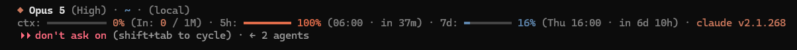

# Claude Statusline

[](https://github.com/chawannua/claude-statusline/releases)


Nordic minimalist statusline for Claude Code CLI with live context gauges, token reset countdowns, and quota telemetry.

## Preview



## Features

- **Nordic Minimalist Aesthetic**: High-density typography with subtle glyphs (`◆`, `·`, `━`).
- **Context Telemetry**: Real-time context window usage gauge with exact input/output tokens.
- **Quota & Reset Countdowns**: Live 5-hour and 7-day rate-limit tracking with exact target reset time and relative countdown.
- **Git Integration**: Current working directory, branch, dirty status indicator, and local fallback.
- **Ultra Fast**: Lightweight, non-blocking execution with zero external runtime dependencies.

## Quick Install

```powershell
Invoke-WebRequest -Uri "https://raw.githubusercontent.com/chawannua/claude-statusline/main/statusline.ps1" -OutFile "$HOME\statusline.ps1"
. $HOME\statusline.ps1
```

## Configuration

Configure the statusline hook in your Claude settings (`~/.claude/settings.json`):

```json
{
  "statusLine": {
    "type": "command",
    "command": "powershell -ExecutionPolicy Bypass -File C:\\Users\\Chawan.CHAWANNUA\\.claude\\statusline.ps1"
  }
}
```

## Versioning

This project strictly follows [Semantic Versioning](https://semver.org/) (`Major.Minor.Patch`):

- **Major** (`X.0.0`): Breaking changes (e.g. `BREAKING CHANGE` or `feat!:`, `refactor!:`)
- **Minor** (`0.X.0`): New features (e.g. `feat:`, `feat(...):`)
- **Patch** (`0.0.X`): Bug fixes, refactors, docs, style, etc. (e.g. `fix:`, `refactor:`, `perf:`, `docs:`, `chore:`)
